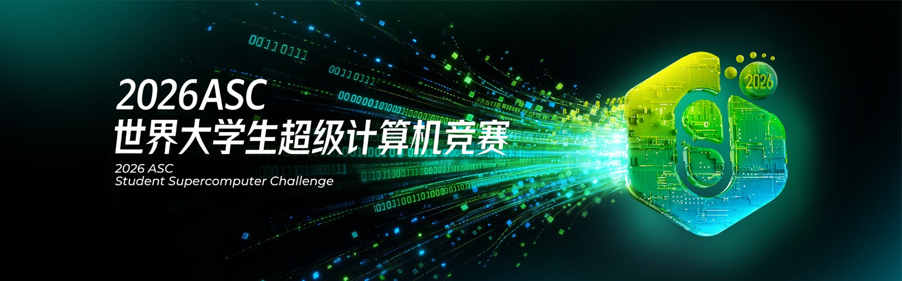
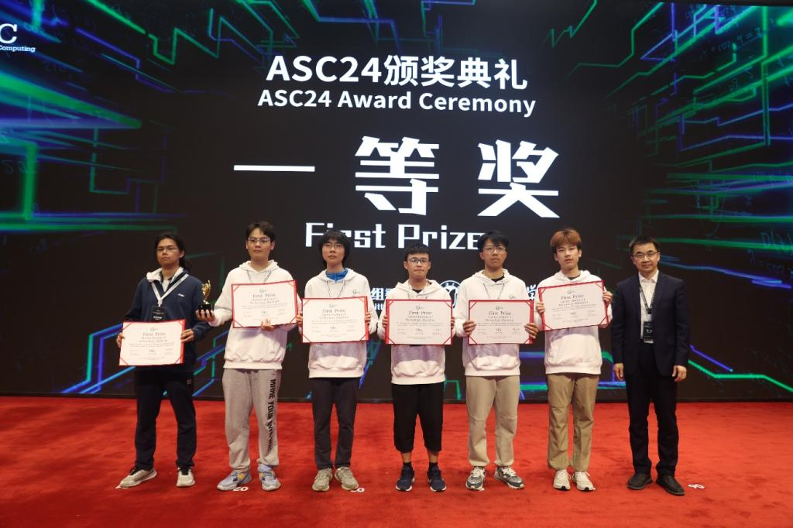

# ASC 学生超算挑战赛

**ASC 世界大学生超级计算机竞赛**（ASC Student Supercomputer Challenge）由亚洲超算社区（Asia Supercomputer Community）发起，并得到亚洲、欧洲与美洲的专家和机构支持；官方宗旨是促进全球超算青年人才的交流与培养、提升超算应用与研发水平、推动超算发展并促进技术与产业创新[^1]。首届比赛于 2012 年举办，当时有来自不同国家的 27 支队伍参赛，决赛在清华大学举行[^1][^2]。按官方页面所述，ASC 已累计吸引全球超过一万名本科生参加[^1]。

图：2026 ASC 世界大学生超级计算机竞赛（图片来源：ASC 官方网站）

## 赛制

- **两个阶段**：参赛队先经过线上报名与预赛，晋级后参加现场决赛。以 ASC26 为例，报名期为 2025 年 11 月 6 日至 2026 年 1 月 12 日，预赛为 2026 年 1 月 13 日至 3 月 4 日，决赛于 2026 年 5 月 16–20 日在无锡学院举行[^3]。
- **功耗限制**：决赛要求参赛队在规定功耗内自行设计并搭建计算平台。ASC26 的总功耗限制为 5 kW，集群至少包含三个计算节点、单节点功耗不超过 2 kW[^3]；ASC25 的限额为 4 kW，单节点 2 kW[^4]；ASC24 的总功耗限制为 3 kW[^5][^8]。
- **比赛负载**：决赛同时考察基准测试与应用优化，基准包括 HPL、HPCG，应用覆盖天气预报、分子动力学、人工智能等方向；ASC25 的赛题涉及 AlphaFold3、RNA m5C 等应用[^4]。
- **团体竞赛**：自 ASC25 起，团体竞赛（Group Competition）被纳入决赛总成绩，鼓励队伍之间在设备互助与应用优化方面展开协作[^4][^3]。
- **奖项设置**：决赛设冠军、亚军、e Prize、Highest Linpack、应用创新奖、最佳展示奖、团体竞赛奖、人气奖与一等奖等[^3][^4]。

## 历届冠军

以下为官方历史页面公布的历届决赛冠军（ASC20-21 与 ASC22-23 为现场与线上合并举办的届次）[^2][^5][^6]：

| 届次 | 决赛冠军 |
| --- | --- |
| ASC 2012 | 清华大学 |
| ASC 2013 | 清华大学 |
| ASC 2014 | 上海交通大学 |
| ASC 2015 | 清华大学 |
| ASC 2016 | 华中科技大学 |
| ASC 2017 | 清华大学 |
| ASC 2018 | 清华大学 |
| ASC 2019 | 台湾清华大学 |
| ASC 2020-2021 | 暨南大学（现场）、台湾清华大学（线上） |
| ASC 2022-2023 | 北京大学（现场）、香港中文大学（线上） |
| ASC 2024 | 北京大学 |
| ASC 2025 | 上海交通大学 |
| ASC 2026 | 北京大学 |

在承办高校与媒体的公开介绍中，ASC 常与德国 ISC、美国 SC 并称为世界三大超算竞赛[^7][^8]。

## 哈尔滨工业大学（深圳）参赛情况

- **ASC 2026**：学校队伍晋级决赛，并在决赛中获得**一等奖**；ASC 官方获奖名单中的 First Prize 一栏列有 Harbin Institute of Technology, Shenzhen[^3]。
- **ASC 2024**：学校队伍获得总决赛**一等奖**，这是校区学子第二次在该赛事中获得一等奖；校方报道提到，该届比赛要求在 3000 瓦功耗内搭建集群，运行 HPL、HPCG、大语言模型推理优化与多个科学应用[^8]。
- **ASC 2022–2023**：学校队伍获得总决赛**一等奖**与**超级团队奖**，是该赛事中校区取得的最好成绩；该届决赛在中国科学技术大学举行[^7]。
- 更完整的队伍与训练情况见[哈尔滨工业大学（深圳）超算队介绍](../about/hitsz-hpc.md)。

图：哈尔滨工业大学（深圳）超算队在 ASC24 颁奖典礼上获得一等奖（图片来源：哈尔滨工业大学（深圳）实验与创新实践教育中心）

## 参考资料

[^1]: [ASC Student Supercomputer Challenge](https://www.asc-events.net/StudentChallenge/index.html)（ASC 官方网站，含赛事简介与 History 栏目入口）
[^2]: [ASC 2012 官方历史页](https://www.asc-events.net/StudentChallenge/History/2012/index.html)
[^3]: [ASC26 Final Competition](https://www.asc-events.net/StudentChallenge/ASC26/final-competition.php)（ASC 官方网站，含时间线、决赛规则与获奖名单）
[^4]: [ASC 2025 官方历史页](https://www.asc-events.net/StudentChallenge/History/2025/index.html)（含决赛通知、赛题说明与获奖名单）
[^5]: [ASC 2024 官方历史页](https://www.asc-events.net/StudentChallenge/History/2024/index.html)
[^6]: ASC 官方历史页：[ASC 2019](https://www.asc-events.net/StudentChallenge/History/2019/index.html)、[ASC 2020-2021](https://www.asc-events.net/StudentChallenge/History/2020-2021/index.html)、[ASC 2022-2023](https://www.asc-events.net/StudentChallenge/History/2022-2023/index.html)（其余年份见官方 History 栏目）
[^7]: [一等奖+超级团队奖！哈工大（深圳）本科生超算队“大丰收”](https://www.hitsz.edu.cn/news/2023/0601/c6a10379/page.htm)（哈尔滨工业大学（深圳）新闻网，2023-06-01）
[^8]: [哈尔滨工业大学（深圳）超算队再获 ASC 超算总决赛一等奖](http://ecei.hitsz.edu.cn/info/1015/4264.htm)（哈尔滨工业大学（深圳）实验与创新实践教育中心，2024-04-19）
