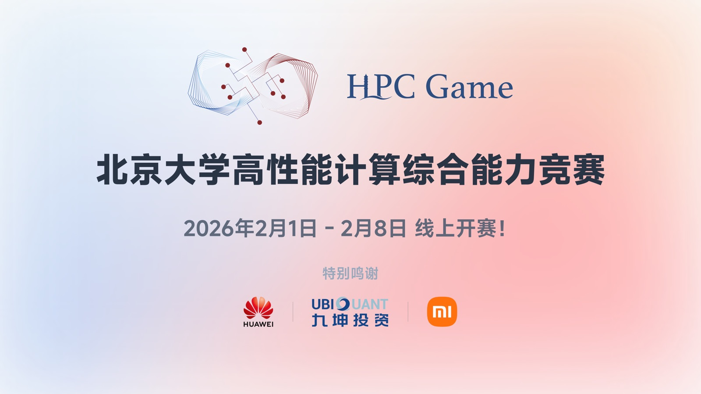
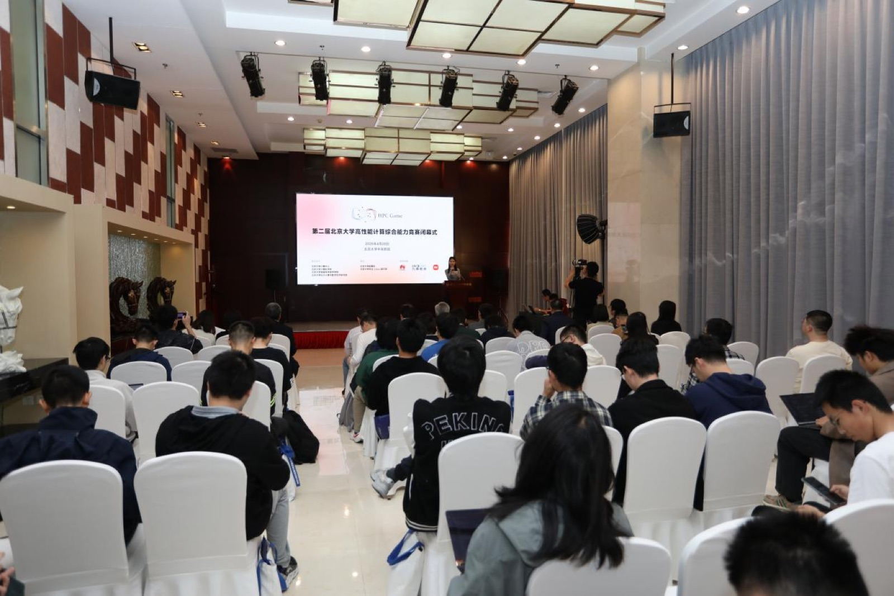

# HPCGame

**北京大学高性能计算综合能力竞赛**（PKU HPCGame）由北京大学计算中心主办，北京大学学生 Linux 俱乐部与未名超算队承办；官方将其定位为“以高性能和并行计算为主题的入门向竞赛”，目的是推动高性能计算在高校中的普及、提升同学们的计算素养[^1]。竞赛面向全国高校在校学生开放，其他院校的学生可以使用教育邮箱注册参赛[^2]。

图：第三届竞赛官方宣传图（图片来源：HPCGame 官方网站）

## 赛制与平台

- **线上解题赛**：比赛全程在线上进行，选手独立解决高性能计算相关问题[^3][^6]。
- **题目方向**：覆盖并行与大规模计算、异构计算与综合能力提升等类别[^1][^4]；第一届的具体赛题涉及编译工具实战、GPU 编程、高性能矩阵乘法与固体磁性计算等[^3]。
- **比赛平台**：赛事依托北京大学高性能计算平台运行。第一届比赛基于 SCOW 算力平台门户与管理系统为选手提供代码调试环境，并提供 25 万核时计算资源；组委会还开发了在线测评系统 AOI，并已在社区开源[^3]。
- **国产算力实践**：第二届比赛深度融合鲲鹏算力基座，共有 216 名选手基于鲲鹏平台提交题目解答，有效提交 1,341 次[^5]。

## 历届情况

| 届次 | 时间 | 规模 | 备注 |
| --- | --- | --- | --- |
| 第零届 | 2023 年 | 61 所高校 341 名选手 | 分个人赛与团队赛两个阶段，提交超过 1 万次[^6] |
| 第一届 | 2024 年 1 月 23–30 日 | 87 所高校 558 名选手 | 13,208 次结果提交，参赛人数较第零届增长 64%[^3] |
| 第二届 | 2025 年 1 月 18–25 日 | 413 名选手 | 华为提供设备、算力与技术支持[^5] |
| 第三届 | 2026 年 2 月 1–8 日 | 72 所高校 645 名选手 | 在高性能计算集群上完成有效提交 15,731 次[^4] |

官方回顾提到，竞赛自 2023 年创办以来已举办 4 届，累计吸引 1,957 名选手参赛，覆盖全国百余所高校[^4]。从历届安排来看，比赛都在每年 1–2 月举行。

## 奖项与影响

第一届比赛产生一等奖 10 名、二等奖 20 名、三等奖 30 名、优胜奖 39 名，并设有 RISC-V 新架构奖与新生特别奖[^3]。北京大学是国内首个举办高性能计算综合能力竞赛的高校[^3]。在官方表述中，这一竞赛“已成为引领国内高校高性能计算领域发展、推动产学研协同创新的重要平台”，并在赛题中持续引入国产算力平台与企业真实场景[^4][^5]。

图：第二届竞赛闭幕式现场（图片来源：华为鲲鹏社区）

---

*本页撰写：AI 助手 `deepseek/deepseek-flash`（2026 年 9 月）；事实与图片出处见页面内引用。*

## 参考资料

[^1]: [比赛通知：第二届北京大学高性能计算综合能力竞赛](https://hpcgame.pku.edu.cn/announcement/fea73a45-59fc-41d1-980a-70a0823973f8)（HPCGame 官方网站公告）
[^2]: [HPCGame 官方网站](https://hpcgame.pku.edu.cn/)（登录页面说明）
[^3]: [第一届北京大学高性能计算综合能力竞赛圆满落幕](https://news.pku.edu.cn/xwzh/d88d71c0c6ca4e5da657bfa66a35b5d4.htm)（北京大学新闻网，2024-04-09）
[^4]: [第三届北京大学高性能计算综合能力竞赛闭幕式暨颁奖典礼举行](https://news.pku.edu.cn/xwzh/072a49a794ba49fdbb2cc4fb30d798d8.htm)（北京大学新闻网，2026-04-24）
[^5]: [第二届北京大学高性能计算大赛，培育鲲鹏算力自主创新生力军](https://www.hikunpeng.com/activities/dynamic-news/477)（华为鲲鹏社区，2025-05-20）
[^6]: [第零届北京大学高性能计算综合能力竞赛赛况与闭幕回顾](https://its.pku.edu.cn/announce/tz20230428105741.jsp)（北京大学计算中心，2023-04-28）
