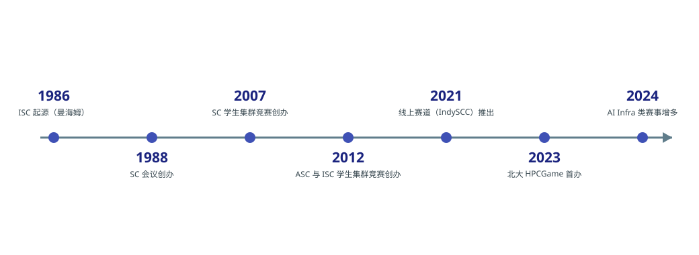

# 比赛简介

高性能计算比赛大致可以分为两类：一类是要求参赛队在规定的功耗或资源限制下搭建真实集群、完成基准测试与应用优化的**集群竞赛**，代表赛事是美国的 SC 学生集群竞赛、欧洲的 ISC 学生集群竞赛与中国的 ASC 学生超算挑战赛；另一类是依托在线平台、以解题形式完成性能优化任务的**挑战赛**，代表赛事是北京大学高性能计算综合能力竞赛（HPCGame）。

图：主要 HPC 竞赛的发展时间线

## 集群竞赛

集群竞赛的共同点是现场搭建真机、限时完成优化并接受评委问辩，考察内容包括集群部署与运维、基准测试调优、科学应用优化与团队协作。三项代表性赛事的情况如下：

| 赛事 | 形式与特点 |
| --- | --- |
| [SC 学生集群竞赛](sc.md) | 2007 年首办，每年 11 月在美国举办；48 小时现场比赛，每队 6 名学生与 1 名指导老师；另设线上赛道 SCC Connect |
| [ISC 学生集群竞赛](isc.md) | 2012 年首办，每年 5–6 月在德国举办；现场三天比赛与线上赛并行，每队最多 6 名学生与 2 名指导老师；现场功率上限 6,000 瓦 |
| [ASC 学生超算挑战赛](asc.md) | 2012 年首办，每年 4–5 月在承办高校举办；预赛加现场决赛；ASC26 决赛功率限制 5 kW，集群至少三个计算节点 |

以上信息分别来自三项赛事的官方页面[^1][^2][^3][^4][^5][^6]。

## 挑战赛

挑战赛以线上解题为主，门槛相对更低，适合作为入门训练。代表赛事是 [HPCGame](hpcgame.md)：它于 2023 年首办，面向全国高校学生开放，题目覆盖并行与大规模计算、异构计算等方向[^7]。

## 其他赛事

除上述经典赛事之外，围绕大模型系统与算力的新赛事在近年明显增多，但多数赛事的历史与体系仍在形成中，具体情况汇总在[其他赛事](other.md)页面。

## 图片版权说明

本页及各分页中的赛事标识与活动照片来自各赛事官方网站或主办单位公开报道，版权归相关主办方或权利人所有，此处仅用于赛事介绍。

## 参考资料

[^1]: [Cluster Competition History](https://sc26.supercomputing.org/students/cluster-competition-history/)（SC 官方竞赛历史页面）
[^2]: [Student Cluster Competition](https://sc26.supercomputing.org/students/student-cluster-competition/)（SC26 官方页面）
[^3]: [Student Cluster Competition](https://isc-hpc.com/program/student-cluster-competition/)（ISC 官方页面）
[^4]: [Student Cluster Competition Rules](https://www.hpcadvisorycouncil.com/events/student-cluster-competition/rules.php)（HPC-AI Advisory Council 官方规则页）
[^5]: [ASC Student Supercomputer Challenge](https://www.asc-events.net/StudentChallenge/index.html)（ASC 官方网站）
[^6]: [ASC26 Final Competition](https://www.asc-events.net/StudentChallenge/ASC26/final-competition.php)（ASC 官方网站）
[^7]: [比赛通知：第二届北京大学高性能计算综合能力竞赛](https://hpcgame.pku.edu.cn/announcement/fea73a45-59fc-41d1-980a-70a0823973f8)（HPCGame 官方网站公告）
