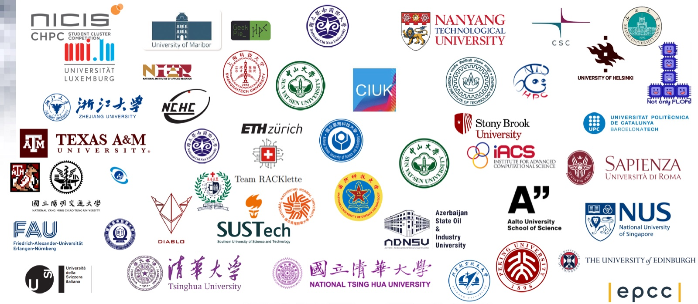

# ISC 学生集群竞赛

**ISC High Performance** 是世界上历史最悠久的超级计算会议。它起源于 1986 年曼海姆大学举办的“超级计算机研讨会”，首届只有 81 名参会者，如今已发展为欧洲规模最大的高性能计算、人工智能与量子计算论坛[^1][^2]。与 SC 类似，ISC 也设有面向大学生的**学生集群竞赛**（Student Cluster Competition，SCC），首届于 2012 年随 ISC'12 在汉堡举办[^3][^4]。

图：ISC High Performance 标识（来源：ISC 官方网站）

## 会议概况

- **起源与更名**：1986 年，曼海姆大学计算机中心主任 Hans Werner Meuer 组织了首届“超级计算机研讨会”；约 15 年后更名为 International Supercomputing Conference，2015 年起正式使用现名 ISC High Performance[^1][^2]。
- **举办地点**：会议长期在德国各城市轮转，曾先后在海德堡、德累斯顿、汉堡、莱比锡与法兰克福举办；2020 与 2021 年因疫情完全转为线上，2022 年起回到汉堡[^2][^5]。
- **TOP500 发布**：自 1993 年起，ISC 一直是每年两次 TOP500 榜单发布的夏季现场；2026 年，TOP500 项目的管理权移交 ACM[^2][^6]。
- **近期规模**：ISC 2025（2025 年 6 月 10–13 日）是 ISC 系列 40 年历史中规模最大的一届，共有 3,585 名参会者与 195 家展商[^7]；ISC 2026（2026 年 6 月 22–26 日，汉堡）吸引了来自 64 个国家的 4,035 名参会者与 188 家展商[^6]。下一届 ISC 2027 将于 2027 年 6 月 7–11 日继续在汉堡举办[^6]。

## 学生集群竞赛

ISC 学生集群竞赛由 ISC 与 HPC-AI Advisory Council 共同组织，分为**线上**与**现场**两个赛段[^3][^8]：

- **现场赛段**：名额限制为十支队伍，各队自带硬件、在会展现场自行搭建集群，在会议期间的三天里运行微基准测试与高性能计算应用[^8]。
- **线上赛段**：面向所有队伍开放，参赛队在数月时间内通过远程集群完成应用优化与基准测试；以 ISC 2026 为例，线上队伍需要远程连接法国的 ROMEO 与美国的 Bridges-2 两台超级计算机[^3][^8]。
- **队伍构成**：每支队伍最多由 6 名学生与 2 名指导老师组成[^9]。
- **功率限制**：现场赛段对整队功率有严格限制，现行规则为 6,000 瓦，通过两路供电并由 PDU 计量，超出会被扣分；该限额自赛事创办起曾长期为 3,000 瓦，2025 年被提高到 6,000 瓦[^9][^10]。
- **比赛负载**：以 ISC 2025 为例，第一天的基准测试包括 LINPACK、HPCG 与 IO500，随后两天是 code_saturne、SeisSol、基于 LLaMA 3.1 的模型微调优化、OpenMX，以及限时四小时的“神秘应用”LAMMPS[^10]。
- **奖项设置**：现场赛段设 Highest LINPACK 奖与前三名，线上赛段设前三名；总成绩由各应用成绩、创新性与评委面试共同决定[^11]。

图：ISC 2026 学生集群竞赛参赛高校标识（来源：ISC 官方网站）

## 近年获奖情况

中国高校在 ISC 学生集群竞赛中表现活跃，近年主要成绩如下[^3][^12][^13]：

| 届次 | 现场赛段冠军 | 线上赛段冠军 | Highest LINPACK |
| --- | --- | --- | --- |
| ISC 2023 | 爱丁堡大学 EPCC | 南洋理工大学 NTU | 苏黎世联邦理工学院 RACKlette |
| ISC 2024 | 清华大学 Diablo | 中山大学 SYSU | 清华大学 Diablo |
| ISC 2025 | 清华大学 Diablo | 中山大学 SYSU | 清华大学 Diablo |
| ISC 2026 | 苏黎世联邦理工学院 RACKlette 与南洋理工大学 NTU 并列 | 北京大学 Peking | 台湾清华大学 Yi Da Tuo |

## 与我们的关系

ISC 学生集群竞赛与 SC 学生集群竞赛、ASC 一起，构成了国际学生集群竞赛的主要格局[^5]。对准备参赛的同学来说，它是了解国际队伍在集群搭建、功耗控制、应用调优与现场协作等方面真实水平的重要窗口。

---

*本页撰写：AI 助手 `deepseek/deepseek-flash`（2026 年 9 月）；事实与图片出处见页面内引用。*

## 参考资料

[^1]: [ISC High Performance History](https://isc-hpc.com/history/)（ISC 官方网站）
[^2]: [ISC High Performance - Wikipedia](https://en.wikipedia.org/wiki/ISC_High_Performance)
[^3]: [Student Cluster Competition](https://isc-hpc.com/program/student-cluster-competition/)（ISC 官方网站）
[^4]: [HPC Advisory Council and the International Supercomputing Conference Announces Call for Submissions for HPCAC-ISC Student Cluster Challenge](https://www.hpcadvisorycouncil.com/pdf/Press_releases/PR_6_20_11_HPCAC_ISC_Cluster_competition.pdf)（HPC Advisory Council 新闻稿，2011-06-20；同见苏黎世联邦理工学院对第 15 届赛事的报道）
[^5]: [Student Cluster Competition Leadership List](https://www.hpcadvisorycouncil.com/student-cluster-competition-leadership-list.php)（HPC-AI Advisory Council）
[^6]: [ISC 2026 Concludes with Record Attendees and TOP500 Moves to ACM](https://isc-hpc.com/isc-2026-concludes-with-record-4035-attendees/)（ISC 官方新闻，2026-07-02）
[^7]: [ISC 2025 Concludes as Most Successful in 40-Year History](https://isc-hpc.com/isc-2025-concludes-as-most-successful-in-40-year-history/)（ISC 官方新闻，2025-06-18）
[^8]: [Student Cluster Competition Overview](https://www.hpcadvisorycouncil.com/events/student-cluster-competition/)（HPC-AI Advisory Council 官方页面）
[^9]: [Student Cluster Competition Rules](https://www.hpcadvisorycouncil.com/events/student-cluster-competition/rules.php)（HPC-AI Advisory Council 官方规则页）
[^10]: [ISC25 Cluster Competition: More Teams, Double Power](https://www.hpcwire.com/2025/07/07/isc25-cluster-competition-more-teams-double-power/)（HPCwire，2025-07-07）
[^11]: [Scoring and Awards](https://www.hpcadvisorycouncil.com/events/student-cluster-competition/scoring.php)（HPC-AI Advisory Council 官方页面）
[^12]: [ISC 2023 Student Cluster Competition](https://www.hpcadvisorycouncil.com/events/2023/student-cluster-competition/index.php)、[ISC 2024 Student Cluster Competition](https://www.hpcadvisorycouncil.com/events/2024/student-cluster-competition/)、[ISC 2025 Student Cluster Competition](https://www.hpcadvisorycouncil.com/events/2025/student-cluster-competition/index.php)（HPC-AI Advisory Council 官方存档页）
[^13]: [How it feels to be a winner](https://www.epcc.ed.ac.uk/whats-happening/articles/how-it-feels-be-winner)（爱丁堡大学 EPCC 官方页面，ISC 2023 SCC 参赛记录）
