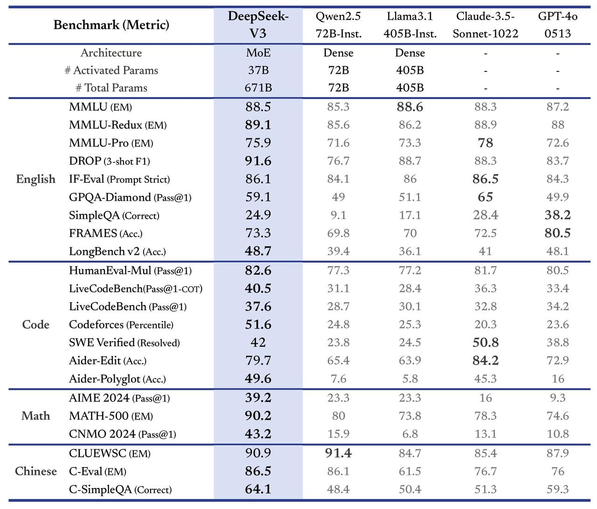
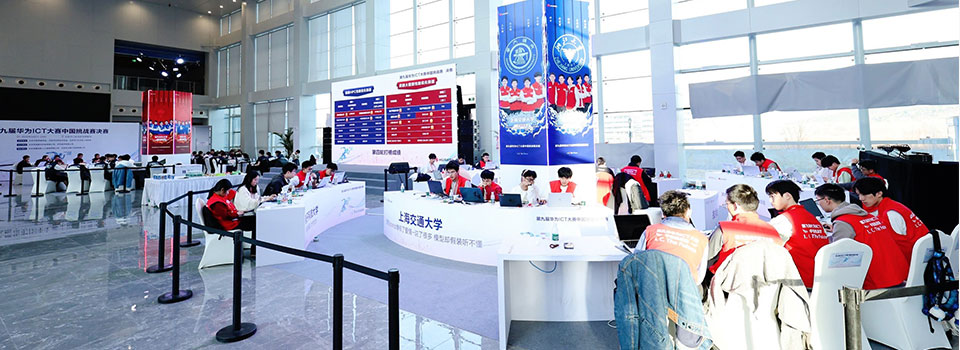

# 其他赛事

除 SC、ISC、ASC 等经典集群竞赛与 HPCGame 这类综合能力挑战赛之外，近年围绕大模型系统与算力的赛事明显增多。一个标志性节点是 2024 年 12 月 26 日 DeepSeek-V3 的发布：官方将其描述为“又一次大幅跃升”，并强调全开源与低成本训练、高效推理[^1][^2]。此后，以 AI Infra（大模型训练与推理基础设施）为核心的比赛开始出现并向算子优化、推理加速、国产算力适配等方向扩展；与经典赛事相比，这些赛事大多历史较短，体系仍在形成中。

图：DeepSeek-V3 发布页给出的官方基准数据（图片来源：DeepSeek 官方文档）

## 华为昇腾与鲲鹏系列

- **昇腾 AI 创新大赛（AAIC）**：面向 AI 开发者的赛事，在新一代人工智能产业技术创新战略联盟（AITISA）与中国人工智能产业发展联盟（AIIA）指导下，由全国各昇腾生态创新中心与华为主办、OpenI 启智社区协办[^3]。2026 年设有“算子挑战赛”（进行到第 9 赛季，基于 Ascend C 与 CANN 做算子性能优化）[^3][^4]与新增的“Harness 挑战赛”（聚焦模型迁移、算子生成与推理加速）[^3]；算子挑战赛的首届 S1 赛季于 2024 年 5 月在北京举办[^5]。
- **鲲鹏创新大赛与鲲鹏高性能计算全球挑战赛**：鲲鹏应用创新大赛自 2020 年起举办[^6]，2025 届更名为“鲲鹏创新大赛”并新设“鲲鹏高性能计算性能挑战赛”[^7]；2026 年开启的鲲鹏高性能计算全球挑战赛，官方定位为“面向高性能计算领域、基于鲲鹏计算平台的并行计算工程挑战赛事”[^7]。
- **华为 ICT 大赛**：面向全球高校的年度 ICT 赛事，2025–2026 赛季设网络、云、基础软件与昇腾 AI 四条赛道[^8]。其中国挑战赛自 2024 年第九届起设置“鲲鹏 HPC 性能优化”与“昇腾大模型性能优化”两个赛道，第十届（2026 年 4 月决赛）合并为“超智融合”单一赛道，赛题涉及 CANN 算子与昇腾推理优化[^9]。哈尔滨工业大学（深圳）超算队在 2026 年华为 ICT 大赛中获得三等奖（见[本队介绍](../about/hitsz-hpc.md)）。

图：华为 ICT 大赛中国总决赛挑战赛现场（图片来源：华为官方技术文章）

## 开源社区与高校平台赛事

- **开放原子大赛**：由开放原子开源基金会主办，口号是“解决‘真问题’，推广开源技术，发现开源人才”；第三届于 2025 年 9 月启动[^10]。其 openKylin 系列赛设有“面向 openKylin 智能引擎的开源大模型推理优化赛”与“基于 openKylin 的人工智能异构算力调度平台挑战赛”等赛项[^11]。
- **全国大学生计算机系统能力大赛·智能计算创新设计赛（先导杯）**：自 2024 年纳入全国大学生计算机系统能力大赛[^12]；2025 年第六届赛题覆盖大模型推理与科学计算，包括“MoE 语言模型端到端效率优化”“ONNX Runtime 算子性能优化”“GMRES 算法优化”等，算力平台由中科曙光提供[^12]。
- **PAC 全国并行应用挑战赛**：已举办十余届；2025 年第十二届的优化赛道要求参赛高校队伍在国产鲲鹏 CPU 上完成 Int8GEMM 与 Attention 算子加速[^13]，2026 年第十三届启用国家超级计算深圳中心“灵晟”作为竞赛平台[^14]。

## 企业与平台发起的推理优化赛事

- **天池（阿里云）与 IEEE AICAS**：AICAS Grand Challenge 系列赛事在 2025 年要求参赛者在 Armv9 架构 CPU 上对 Qwen 大模型做端侧软硬件协同优化[^15]；2026 年要求对通义千问 Qwen3-VL-2B-Instruct 模型进行推理优化与部署，并鼓励算子融合、计算调度、内存管理等系统级方案[^16]。
- **OpenBMB 与昇腾生态**：MiniCPM & 昇腾推理优化与应用创新挑战赛围绕 MiniCPM-o 4.5 全模态模型，设 llama.cpp-omni 与 vLLM-Omni 两个子赛道，要求完成模型在昇腾 NPU 上的适配、部署与性能优化，并统一采用单卡 910C 评测[^17]。
- **AMD 与 GPU MODE**：AMD 发起的分布式推理算子优化挑战赛面向全球开发者，优化 AllGather、ReduceScatter、All2All 等通信算子以提升大语言模型分布式推理性能[^18]；MLSys 2026 Competition Track 也设有基于 AWS Trainium 的 MoE 内核挑战赛与 FlashInfer 内核生成赛项[^19]。
- **百度飞桨 AI Studio**：相关赛事的赛题包含“AIGC 推理性能优化”“搜索模型推理优化”等方向，鼓励使用模型量化压缩、异构算子优化等手段提升推理性能[^20]。

## 观察

与 SC、ISC、ASC 等已延续十余年的赛事相比，上面这些赛事大多创办于 2024–2026 年，采用赛季制或与企业生态深度绑定，题目与评测标准仍在持续调整：例如 AICAS Grand Challenge 自 2024 年 12 月才启动初赛[^15]，MiniCPM 挑战赛为 2026 年首办[^17]，鲲鹏高性能计算全球挑战赛与 Harness 挑战赛也都是在 2026 年新出现的赛事[^7][^3]；即便是历史较久的鲲鹏与 PAC 系列，面向大模型算子与推理的赛题也是近年才加入[^13][^9]。

对刚开始接触超算竞赛的同学来说，这些赛事可以作为练习算子优化、模型部署与国产平台适配的补充途径；同时建议以各赛事官方渠道公布的信息为准。

---

*本页撰写：AI 助手 `deepseek/deepseek-flash`（2026 年 9 月）；事实与图片出处见页面内引用。*

## 参考资料

[^1]: [Introducing DeepSeek-V3](https://api-docs.deepseek.com/news/news1226)（DeepSeek 官方文档）
[^2]: [deepseek-ai/DeepSeek-V3](https://github.com/deepseek-ai/DeepSeek-V3)（DeepSeek 官方仓库）
[^3]: [昇腾 AI 创新大赛 2026](https://www.hiascend.com/developer/AAIC2026)（昇腾社区官方页面）
[^4]: [昇腾算子挑战赛](https://www.hiascend.com/developer/ops)（昇腾社区官方页面）
[^5]: [2024 年昇腾 AI 原生创新算子挑战赛 S1、S2 赛季举办](http://cs.bjtu.edu.cn/jdxw/202314859.htm)（北京交通大学计算机学院新闻网）
[^6]: [鲲鹏应用创新大赛 2020 全国总决赛结束](https://www.huawei.com/cn/news/2020/8/huawei-kunpeng-contest)（华为官方新闻）
[^7]: [鲲鹏创新大赛 2025](https://www.hikunpeng.com/zh/developer/contests/kunpeng-competition2025/)、[鲲鹏高性能计算全球挑战赛](https://www.hikunpeng.com/developer/contests/details/bbb369de3db64a8eac4c84731f65fd53)（鲲鹏社区官方页面）
[^8]: [华为 ICT 大赛 2025–2026](https://www.huawei.com/minisite/ict-competition-2025-2026-global/cn/)（华为官方赛事站点）
[^9]: [从第九届到第十届：华为 ICT 大赛挑战赛回顾](https://www.huawei.com/cn/huaweitech/publication/202602/huawei-ict-competition)（华为官方技术文章）
[^10]: [开放原子大赛](https://competition.openatom.tech/)（开放原子开源基金会官方赛事平台）、[第三届开放原子大赛启动](https://www.openatom.org/journalism/detail/1cOfkX8b8WrK)（基金会官方新闻）
[^11]: [第三届开放原子大赛—openKylin 系列赛](https://www.openkylin.top/news/3855-cn.html)（openKylin 官方站点）
[^12]: [第六届“先导杯”智能计算创新设计赛开赛](https://news.ustc.edu.cn/info/1055/91699.htm)（中国科学技术大学新闻网）
[^13]: [第十二届全国并行应用挑战赛总决赛举行](https://www.cs.tsinghua.edu.cn/info/1058/6859.htm)（清华大学计算机系新闻）
[^14]: [第十三届并行应用挑战赛 PAC 2026 开幕](https://cn.chinadaily.com.cn/a/202606/15/WS6a2fc271a310d709c2fb82cf.html)（中国日报网）
[^15]: [IEEE AICAS 2025 Grand Challenge 赛道说明](https://aicas2025.org/wp-content/uploads/2024/12/AICAS-2025-GC-track-1.pdf)（AICAS 2025 官方网站）
[^16]: [IEEE AICAS 2026 Grand Challenge - Efficient Inference and Optimization Track](https://tianchi.aliyun.com/competition/entrance/532450/introduction)（阿里云天池官方页面）
[^17]: [MiniCPM & 昇腾推理优化与应用创新挑战赛](https://ascend.openbmb.cn/competition)（OpenBMB 官方赛事站点）
[^18]: [上海交大团队获 AMD 分布式推理算子优化挑战赛特等奖](https://news.sjtu.edu.cn/jdyw/20251231/218629.html)（上海交通大学新闻网）
[^19]: [AWS Trainium2 与 Trainium3 MoE Kernel Challenge](https://github.com/aws-neuron/nki-moe)、[MLSys 2026 FlashInfer AI Kernel Generation Contest](https://mlsys26.flashinfer.ai/)（赛事官方页面）
[^20]: [百度商业 AI 技术创新大赛](https://aistudio.baidu.com/competition/detail/913)（飞桨 AI Studio 官方页面）
