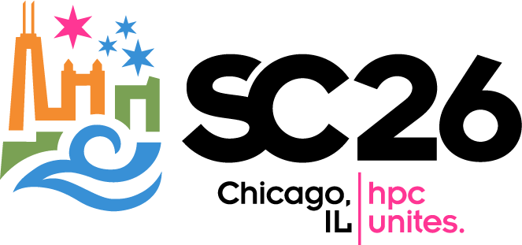
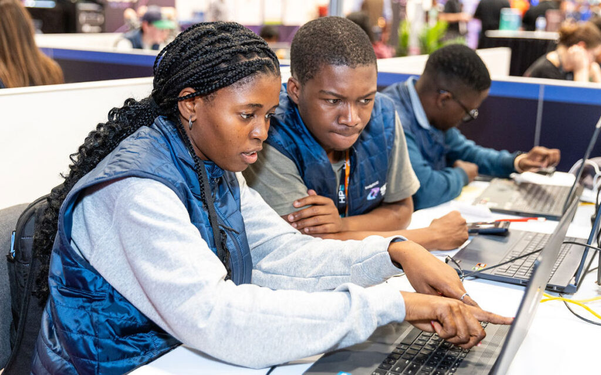

# SC 学生集群竞赛

**SC**（The International Conference for High Performance Computing, Networking, Storage and Analysis）是高性能计算领域最重要的国际会议之一，由 ACM 与 IEEE 计算机学会于 1988 年创办，每年 11 月在美国举办[^1]。作为 SC 面向学生的活动之一，**学生集群竞赛**（Student Cluster Competition，SCC）自 2007 年创办以来已经走过近 20 届，是各类学生集群竞赛的重要参照[^2][^3]。

图：SC26 会议标识（图片来源：SC 官方网站）

## 赛事概况

!!! quote "官方介绍"

    In 2007, the Student Cluster Competition (SCC) was created to help foster students in all aspects of HPC, providing opportunities for students to showcase their expertise in a friendly, spirited competition.

    —— SC 官方竞赛历史页面[^3]

- **参赛队**：每队 6 名学生，外加 1 名指导老师和提供硬件与软件资源的厂商伙伴[^2]。
- **比赛形式**：在 SC 会展现场的展厅内搭建小型集群，进行不中断的 48 小时比赛[^2]。
- **比赛内容**：参赛队需要学习并优化真实科学应用程序与基准测试；近年涉及 HPL、HPL-MxP 与 MLPerf 系列基准，以及 WRF、MFC 等应用软件[^3]。
- **线上赛道**：2021 年新增线上赛 IndySCC，面向经验较少或经费有限的队伍；2026 年起更名为 SCC Connect，由组委会提供云端计算资源，参赛队无需自带硬件或到场[^3]。

图：SC25 学生集群竞赛现场（图片来源：SC 官方网站）

## 近年情况

- **SC24**（2024 年 11 月，亚特兰大）：清华大学获得 SCC 总冠军，南洋理工大学以 236.4 TFLOPS 获得 Highest Linpack[^3]。
- **SC25**（2025 年 11 月，圣路易斯）：台湾大学获得 SCC 总冠军；浙江大学获得 IndySCC 冠军，该届 IndySCC 共有来自 13 个国家的 33 支队伍参加[^3][^4]。
- **SC26**（2026 年 11 月 15–20 日，芝加哥）：将迎来 SCC 创办 20 周年，SCC 的比赛日期为 11 月 16–18 日[^3]。

## 与我们的关系

SC 学生集群竞赛与 ISC 学生集群竞赛、ASC 一起，构成了国际学生集群竞赛的主要格局[^5]。对准备参赛的同学来说，SC 的赛题设计与现场组织形式是了解国际同类赛事的重要参照，其官网还整理了历届参赛队伍、基准测试、应用与海报等完整资料[^3]。

---

*本页撰写：AI 助手 `deepseek/deepseek-flash`（2026 年 9 月）；事实与图片出处见页面内引用。*

## 参考资料

[^1]: [ACM/IEEE Supercomputing Conference - Wikipedia](https://en.wikipedia.org/wiki/Supercomputing_Conference)
[^2]: [Student Cluster Competition](https://sc26.supercomputing.org/students/student-cluster-competition/)（SC26 官方网站）
[^3]: [Cluster Competition History](https://sc26.supercomputing.org/students/cluster-competition-history/)（SC26 官方网站）
[^4]: [SC25](https://sc25.supercomputing.org/)（SC25 官方网站）
[^5]: [Student Cluster Competition Leadership List](https://www.hpcadvisorycouncil.com/student-cluster-competition-leadership-list.php)（HPC-AI Advisory Council）
